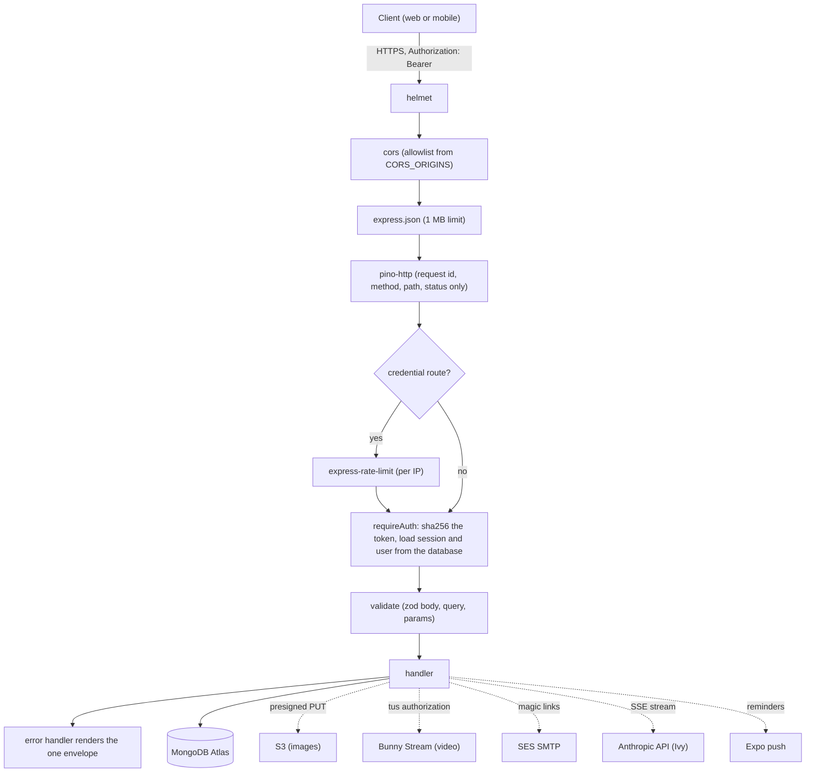

# Vegan Grove API

**The one server: opaque sessions, zod at every boundary, visibility decided before a byte leaves.**

[](https://github.com/wbaxterh/vegan-grove-api/actions/workflows/ci.yml)     [](./LICENSE) [](https://docs.vegangrove.org)

Vegan Grove is a privacy-first vegan community and activism platform for Southern California. This repository is the backend: an Express 5 and Mongoose 9 service in TypeScript that resolves a session, validates input, enforces visibility, queries MongoDB Atlas, and answers both clients under `api.vegangrove.org/api/*`. It is the only component that reads member data, and it hands bytes (images, video, map tiles) to other services so it never proxies them.

## Part of Vegan Grove

| Repository | Role | Stack | Deploys to |
|---|---|---|---|
| [vegan-grove-api](https://github.com/wbaxterh/vegan-grove-api) (this repo) | REST API, Socket.IO, workers, the only reader of the database | Express 5, Mongoose 9, zod, pino, Socket.IO, vitest | One EC2 instance, PM2 behind nginx, `us-east-1` |
| [vegan-grove-web](https://github.com/wbaxterh/vegan-grove-web) | Public site and the `/app` member area | Next.js 15, Tailwind 4, shadcn/ui, MapLibre GL | AWS Amplify Hosting, `us-east-1`, on push to `main` |
| [vegan-grove-mobile](https://github.com/wbaxterh/vegan-grove-mobile) | iOS and Android app | Expo SDK 57, expo-router, TanStack Query, MapLibre | EAS Build, App Store and Play |
| [vegan-grove-docs](https://github.com/wbaxterh/vegan-grove-docs) | Product, privacy, and architecture docs | PokeDocs on Docusaurus 3 | AWS Amplify Hosting, `us-east-1`, on push to `main` |

Docs: [docs.vegangrove.org](https://docs.vegangrove.org). Product: [vegangrove.org](https://vegangrove.org). Both domains and `api.vegangrove.org` are launching.

## Architecture

Every request walks the same chain. Order matters: helmet and cors run before anything can echo input, pino-http runs before auth so a rejected request still gets a log line with a request id, and the error handler is last so every failure renders `{ error: { code, message } }`.



Conventions the clients build against: `Authorization: Bearer <session token>`, lists as `{ items, nextCursor }` over `_id` (no page or skip), errors as `{ error: { code, message } }` with `details` on validation failures, and `501 not_implemented` from every route that is planned but not built, after its input has been validated. Socket.IO's `/messages` namespace authenticates with the same session token in `handshake.auth.token`; there is no JWT anywhere.

## Quick start

```bash
nvm use                 # Node 24, from .nvmrc
npm ci
cp .env.example .env    # MONGODB_URI is the only value development needs
npm run dev             # tsx watch, http://localhost:4000
npm run validate        # biome check, tsc --noEmit, vitest run, tsc build
```

`GET /healthz` answers `{ ok: true }` once the database pings. Every other route lives under `/api`. Tests run against `mongodb-memory-server`, which downloads a MongoDB binary on first run (set `MONGOMS_VERSION` if the default has no build for your platform). Husky runs Biome on staged code and `secretlint` on every staged file; a finding is a stop.

## Scripts

| Script | What it does |
|---|---|
| `npm run dev` | `tsx watch src/server.ts`, restarts on change |
| `npm run build` | `tsc -p tsconfig.build.json` into `dist/` |
| `npm start` | `node dist/server.js`, what PM2 runs in production |
| `npm test` | `vitest run` against an in-memory MongoDB |
| `npm run lint` | `biome check .` |
| `npm run lint:fix` | `biome check --write .` |
| `npm run typecheck` | `tsc --noEmit` |
| `npm run validate` | lint, typecheck, test, build: the CI contract and the PR gate |
| `npm run seed:places:osm` | Overpass importer for `diet:vegan` places in the SoCal bbox; `-- --dry-run` prints counts only, a real run upserts as `pending` by `osmId` and never resets an approved place |
| `npm run prepare` | installs the husky hooks |

## Configuration

Every variable is listed in [`.env.example`](./.env.example) with a one-line comment and validated at boot by `src/config/env.ts`; a bad or missing value fails the start with a list of problems. Production additionally requires `EMAIL_TRANSPORT=smtp`, `CORS_ORIGINS`, and `DM_ENCRYPTION_KEY`. Names and shapes only; never commit a `.env`.

| Variable | Purpose | Shape |
|---|---|---|
| `NODE_ENV` | Runtime mode | `development`, `test`, or `production` |
| `PORT` | Listen port | integer, dev default 4000 |
| `LOG_LEVEL` | pino level | `info` by default |
| `TRUST_PROXY` | Proxies in front of the app so rate limits see the client | `1` behind nginx |
| `CORS_ORIGINS` | Browser origins allowed by CORS | comma-separated origins |
| `MONGODB_URI` | Connection string, required | Atlas SRV or local URI |
| `MONGODB_DB_NAME` | Database name when the URI carries none | string |
| `SESSION_TTL_DAYS` | Sliding session lifetime | integer, default 30 |
| `MAGIC_LINK_TTL_MINUTES` | Magic link lifetime | integer, default 15 |
| `MAGIC_LINK_BASE_URL` | Page the link points to, `?token=` is appended | URL |
| `RATE_LIMIT_AUTH_MAX` | Per IP per 15 min on register, login, verify, provider sign-in | integer, default 20 |
| `RATE_LIMIT_MAGIC_LINK_MAX` | Per IP per 15 min on magic-link requests | integer, default 5 |
| `RATE_LIMIT_COMPANION_MAX` | Per member per 15 min on companion turns | integer, default 60 |
| `EMAIL_TRANSPORT` | `smtp` (SES) or `log`; `log` prints that a link was issued, never the token | default `log` |
| `EMAIL_FROM` | From header on outbound mail | address |
| `SMTP_HOST` | SES SMTP endpoint for the region | hostname |
| `SMTP_PORT` | STARTTLS or TLS | `587` or `465` |
| `SMTP_USER` | SES SMTP username | string |
| `SMTP_PASS` | SES SMTP password | secret |
| `AWS_REGION` | Region for S3; credentials come from the instance role or the CLI chain | default `us-east-1` |
| `S3_MEDIA_BUCKET` | Bucket that receives presigned image uploads; uploads answer 503 until set | bucket name |
| `S3_PRESIGN_TTL_SECONDS` | Presigned PUT lifetime | integer, default 300 |
| `BUNNY_STREAM_LIBRARY_ID` | Bunny Stream library (milestone 2) | id |
| `BUNNY_STREAM_API_KEY` | Bunny Stream key (milestone 2) | secret |
| `ANTHROPIC_API_KEY` | Companion; chat answers 503 until set | secret |
| `COMPANION_MODEL` | Claude model id, never a literal in code | default `claude-opus-5` |
| `COMPANION_MAX_TOKENS` | Max output tokens per turn | integer, default 8192 |
| `COMPANION_HISTORY_LIMIT` | Prior turns sent back to the model | integer, default 20 |
| `DM_ENCRYPTION_KEY` | AES-256-GCM key for messages at rest | 32 random bytes, base64 (`openssl rand -base64 32`) |
| `DM_KEY_ID` | Label stored with each message so keys can rotate | default `v1` |
| `DM_RETENTION_DAYS` | Days before a message row expires | integer, default 90 |
| `APPLE_CLIENT_ID` | Sign in with Apple audience | bundle id or services id |
| `GOOGLE_CLIENT_IDS` | Google OAuth audiences (iOS, Android, web) | comma-separated client ids |
| `OVERPASS_URL` | Mirror for the OSM seed script | URL, default kumi.systems |
| `STATS_CACHE_TTL_MS` | Cache lifetime for `GET /api/stats` | integer, default 300000 |
| `REMINDER_TICK_MS` | Reminder worker interval | integer, default 60000 |

## Project layout

```
src/
  app.ts              buildApp(deps): middleware chain, routers, 404, error handler; never listens
  server.ts           loads env, connects, attaches Socket.IO and workers, listens, drains on SIGTERM
  config/env.ts       zod-validated environment, the only place process.env is read
  db/mongoose.ts      one connection, index sync, graceful disconnect
  models/             one Mongoose schema per collection, indexes and TTLs declared inline
  routes/             one router per resource group, each a <name>Router(deps) factory
  services/           auth, sessions, magic links, email, places, stats, uploads, companion, DM crypto
  middleware/         requireAuth, requireAdmin, validate, rate limits, error handler
  socket/             the /messages namespace and its rooms
  workers/            reminder sender, start and stop wired into shutdown
  lib/                logger with redaction, AppError, cursor pagination, slugs, SSE helpers
  types/              Express request augmentation (req.auth)
scripts/
  seed-places-osm.ts  Overpass importer behind seed:places:osm
test/                 vitest + supertest suites and the in-memory MongoDB helpers
ecosystem.config.cjs  PM2 definition; secrets come from the env file on the host, never from here
```

## What works today

- Health and stats: `GET /healthz` with a database ping, `GET /api/stats` public and cached for five minutes.
- Auth, tested end to end: register and login (argon2id), magic link issue (always `202`, so the endpoint cannot enumerate accounts) and verify, logout. Sign in with Apple and Google verify the provider token server-side and answer `503 provider_unconfigured` until their client ids are set.
- Sessions: random 32-byte tokens returned once, stored as SHA-256 hashes, sliding 30-day expiry, list and revoke under `/api/me/sessions`.
- Member record: `GET`, strict `PATCH`, and `DELETE /api/me` as a hard delete.
- Places: list by bounding box (approved only), get by slug, submit as `pending`, admin pending queue with approve and reject. Admin role is read from the database on every request.
- Companion: `POST /api/companion/chat` streams SSE (`meta`, `delta`, `done` or `error`) with a per-member rate limit; unpinned conversations carry a 24-hour TTL.
- Wired but waiting on their routes: the `/messages` Socket.IO namespace (session auth, `user:` and `conversation:` rooms with membership checks), the presigned S3 upload service, the AES-256-GCM message cipher, and the reminder worker tick.
- Ten vitest suites, including one that proves every stub validates and answers `501` in the standard shape.

## Not yet

Every route below exists, is mounted, validates its input, and answers `501 { error: { code: 'not_implemented' } }` with a `// TODO(m2)` comment beside it. Implement in place; do not add a parallel route.

- Place reviews and place lists; events, groves, organizations; friends and invites.
- Feed, posts, reactions, comments, saves, a handle's public posts, reports.
- Upload presign and video create; conversations and messages over REST.
- Media library, guides, the private action log, push tokens, notification preferences.
- Companion conversation list, pin, and delete; admin media and guide CRUD and the report queue; reminder delivery.

## Privacy, by construction

- The principal is `req.auth.user`, loaded from the database by `requireAuth` on every request. No user id, email, or role is ever read from a body, a query, or a token.
- Visibility is filtered in the query, on the server, before anything leaves. Public place reads return approved rows only; a member sees their own sessions and nothing else's.
- Logs carry request id, method, path, and status. The query string is dropped on purpose (a bounding box is a location), bodies are never serialized, and pino redacts authorization headers, cookies, passwords, emails, and tokens.
- Session tokens are stored only as SHA-256 hashes, so a database read cannot be replayed as a login. Magic links are hashed the same way and expire in 15 minutes.
- Account deletion removes the user, sessions, friendships, invites, RSVPs, grove memberships, posts, comments, reactions, saves, messages, conversations, action log, companion conversations, place lists, push tokens, and preferences in one pass; places, reviews, and reports the member submitted stay, detached.
- Direct messages are encrypted at rest with AES-256-GCM under a rotatable key id and expire after 90 days by default.

The full promise, data inventory, and threat model: [docs.vegangrove.org/privacy](https://docs.vegangrove.org/privacy).

## Contributing, security, license

The code is public so anyone can audit how member data is handled; read [`CONTRIBUTING.md`](./CONTRIBUTING.md) before opening a PR and [`SOUL.md`](./SOUL.md) before changing a route. Report vulnerabilities through the process in [`SECURITY.md`](./SECURITY.md), never in a public issue. The [`LICENSE`](./LICENSE) is proprietary: read it, study it, contribute to it, and do not redistribute it.

Built by [Wes Huber](https://weshuber.com) · Sibling of [The Trick Book](https://thetrickbook.com) · Docs by [PokeDocs](https://github.com/wbaxterh/pokedocs)
