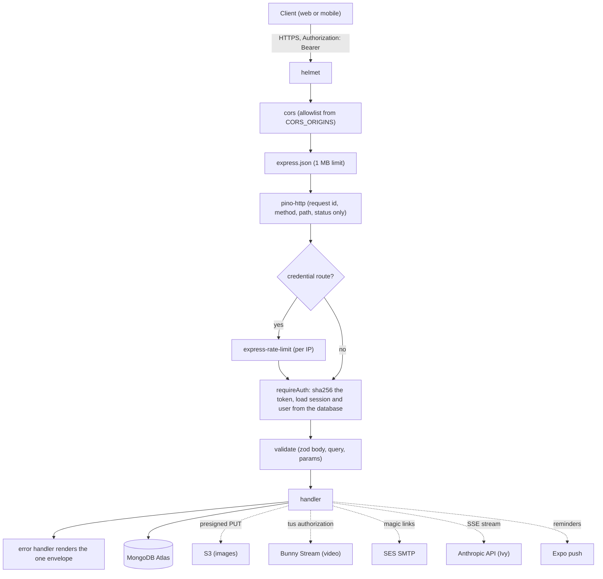

# Vegan Grove API

**The one server: opaque sessions, zod at every boundary, visibility decided before a byte leaves.**

[](https://github.com/wbaxterh/vegan-grove-api/actions/workflows/ci.yml)     [](./LICENSE) [](https://docs.vegangrove.org)

Vegan Grove is a privacy-first vegan community and activism platform for Southern California. This repository is the backend: an Express 5 and Mongoose 9 service in TypeScript that resolves a session, validates input, enforces visibility, queries MongoDB Atlas, and answers both clients under `api.vegangrove.org/api/*`. It is the only component that reads member data, and it hands bytes (images, video, map tiles) to other services so it never proxies them.

## Part of Vegan Grove

| Repository | Role | Stack | Deploys to |
|---|---|---|---|
| [vegan-grove-api](https://github.com/wbaxterh/vegan-grove-api) (this repo) | REST API, Socket.IO, workers, the only reader of the database | Express 5, Mongoose 9, zod, pino, Socket.IO, vitest | One EC2 instance, PM2 behind nginx, `us-east-1` |
| [vegan-grove-web](https://github.com/wbaxterh/vegan-grove-web) | Public site and the `/app` member area | Next.js 15, Tailwind 4, shadcn/ui, MapLibre GL | AWS Amplify Hosting, `us-east-1`, on push to `main` |
| [vegan-grove-mobile](https://github.com/wbaxterh/vegan-grove-mobile) | iOS and Android app | Expo SDK 57, expo-router, TanStack Query, MapLibre | EAS Build, App Store and Play |
| [vegan-grove-docs](https://github.com/wbaxterh/vegan-grove-docs) | Product, privacy, and architecture docs | PokeDocs on Docusaurus 3 | AWS Amplify Hosting, `us-east-1`, on push to `main` |

Docs: [docs.vegangrove.org](https://docs.vegangrove.org). Product: [vegangrove.org](https://vegangrove.org). Both domains and `api.vegangrove.org` are launching.

## Architecture

Every request walks the same chain. Order matters: helmet and cors run before anything can echo input, pino-http runs before auth so a rejected request still gets a log line with a request id, and the error handler is last so every failure renders `{ error: { code, message } }`.


```mermaid
flowchart TB
  C["Client (web or mobile)"] -->|"HTTPS, Authorization: Bearer"| H[helmet]
  H --> O["cors (allowlist from CORS_ORIGINS)"]
  O --> J["express.json (1 MB limit)"]
  J --> P["pino-http (request id, method, path, status only)"]
  P --> R{"credential route?"}
  R -->|yes| L["express-rate-limit (per IP)"] --> S
  R -->|no| S["requireAuth: sha256 the token, load session and user from the database"]
  S --> V["validate (zod body, query, params)"]
  V --> X[handler]
  X --> E["error handler renders the one envelope"]
  X --> Atlas[("MongoDB Atlas")]
  X -.->|presigned PUT| S3["S3 (images)"]
  X -.->|tus authorization| Bunny["Bunny Stream (video)"]
  X -.->|magic links| SES["SES SMTP"]
  X -.->|SSE stream| Ivy["Anthropic API (Ivy)"]
  X -.->|reminders| Push["Expo push"]
```

Conventions the clients build against: `Authorization: Bearer <session token>`, lists as `{ items, nextCursor }` over `_id` (no page or skip), errors as `{ error: { code, message } }` with `details` on validation failures, and `501 not_implemented` from every route that is planned but not built, after its input has been validated. Socket.IO's `/messages` namespace authenticates with the same session token in `handshake.auth.token`; there is no JWT anywhere.

## Quick start

```bash
nvm use                 # Node 24, from .nvmrc
npm ci
cp .env.example .env    # MONGODB_URI is the only value development needs
npm run dev             # tsx watch, http://localhost:4000
npm run validate        # biome check, tsc --noEmit, vitest run, tsc build
```

`GET /healthz` answers `{ ok: true }` once the database pings. Every other route lives under `/api`. Tests run against `mongodb-memory-server`, which downloads a MongoDB binary on first run (set `MONGOMS_VERSION` if the default has no build for your platform). Husky runs Biome on staged code and `secretlint` on every staged file; a finding is a stop.

## Scripts

| Script | What it does |
|---|---|
| `npm run dev` | `tsx watch src/server.ts`, restarts on change |
| `npm run build` | `tsc -p tsconfig.build.json` into `dist/` |
| `npm start` | `node dist/server.js`, what PM2 runs in production |
| `npm test` | `vitest run` against an in-memory MongoDB |
| `npm run lint` | `biome check .` |
| `npm run lint:fix` | `biome check --write .` |
| `npm run typecheck` | `tsc --noEmit` |
| `npm run validate` | lint, typecheck, test, build: the CI contract and the PR gate |
| `npm run seed:places:osm` | Overpass importer for `diet:vegan` places in the SoCal bbox; `-- --dry-run` prints counts only, a real run upserts by `(source, sourceId)` through the ingest service as `pending` (`-- --approve` lands approved) and never resets a moderated row or an admin-edited field. Skips fast food unless fully vegan, flags chains, maps hours, phone, website, postcode, cuisine and access tags |
| `npm run seed:places:gardens` | Same pipeline for OSM community gardens (`leisure=garden` + `garden:type=community`) and named allotments, as type `garden`, fully vegan. Both OSM seeds query Overpass per 0.25 degree tile with retries and fall back to overpass-api.de |
| `npm run seed:sanctuaries` | Curated sanctuaries from `scripts/data/sanctuaries.json`, approved on insert |
| `npm run seed:groves` | The ten regional Groves, one per home area, idempotent by slug |
| `npm run seed:gardens:curated` | Curated community gardens from `scripts/data/gardens-curated.json` (same shape as the sanctuaries file plus `type`) as approved rows |
| `npm run make-admin -- <email>` | Flip an existing member's role to admin |
| `npm run ingest:events:ics` | ICS calendar feeds from `scripts/data/event-sources.json`, POSTed to `/api/ingest/events` |
| `npm run ingest:events:jsonld` | schema.org `Event` JSON-LD from the allowlisted pages in the same file; a `detailLinkPattern` per source crawls the matching detail pages (at most 50, one per second) for sites that only mark up the detail page |
| `npm run ingest:organizations` | Curated `scripts/data/organizations.json` to `/api/ingest/organizations` |
| `npm run ingest:media:wikidata` | Curated seed (`scripts/data/media-seed.json`, ids completed from Wikidata) plus one SPARQL discovery query, both to `/api/ingest/media`; caches both batches for the TMDB step |
| `npm run ingest:media:seed` | The curated seed alone, no discovery |
| `npm run ingest:media:tmdb` | Synopsis, poster (to S3) and JustWatch-attributed watch providers for items with a TMDB id; needs `TMDB_API_KEY` |
| `npm run ingest:guides` | Guide drafts from `scripts/data/guides.json` to `/api/ingest/guides`, landing as `draft` |
| `npm run ingest:places:osm`, `ingest:places:gardens`, `ingest:sanctuaries` | Aliases for the three seed scripts, using the names from the ingest contract |
| `npm run prepare` | installs the husky hooks |

Every seed and ingest script takes `--dry-run`. Run it first against production, always.

## Configuration

Every variable is listed in [`.env.example`](./.env.example) with a one-line comment and validated at boot by `src/config/env.ts`; a bad or missing value fails the start with a list of problems. Production additionally requires `EMAIL_TRANSPORT=smtp`, `CORS_ORIGINS`, and `DM_ENCRYPTION_KEY`. Names and shapes only; never commit a `.env`.

| Variable | Purpose | Shape |
|---|---|---|
| `NODE_ENV` | Runtime mode | `development`, `test`, or `production` |
| `PORT` | Listen port | integer, dev default 4000 |
| `LOG_LEVEL` | pino level | `info` by default |
| `TRUST_PROXY` | Proxies in front of the app so rate limits see the client | `1` behind nginx |
| `CORS_ORIGINS` | Browser origins allowed by CORS | comma-separated origins |
| `MONGODB_URI` | Connection string, required | Atlas SRV or local URI |
| `MONGODB_DB_NAME` | Database name when the URI carries none | string |
| `SESSION_TTL_DAYS` | Sliding session lifetime | integer, default 30 |
| `MAGIC_LINK_TTL_MINUTES` | Magic link lifetime | integer, default 15 |
| `MAGIC_LINK_BASE_URL` | Page the link points to, `?token=` is appended | URL |
| `RATE_LIMIT_AUTH_MAX` | Per IP per 15 min on register, login, verify, provider sign-in | integer, default 20 |
| `RATE_LIMIT_MAGIC_LINK_MAX` | Per IP per 15 min on magic-link requests | integer, default 5 |
| `RATE_LIMIT_COMPANION_MAX` | Per member per 15 min on companion turns | integer, default 60 |
| `EMAIL_TRANSPORT` | `smtp` (SES) or `log`; `log` prints that a link was issued, never the token | default `log` |
| `EMAIL_FROM` | From header on outbound mail | address |
| `SMTP_HOST` | SES SMTP endpoint for the region | hostname |
| `SMTP_PORT` | STARTTLS or TLS | `587` or `465` |
| `SMTP_USER` | SES SMTP username | string |
| `SMTP_PASS` | SES SMTP password | secret |
| `AWS_REGION` | Region for S3; credentials come from the instance role or the CLI chain | default `us-east-1` |
| `S3_MEDIA_BUCKET` | Bucket that receives presigned image uploads; uploads answer 503 until set | bucket name |
| `S3_PRESIGN_TTL_SECONDS` | Presigned PUT lifetime | integer, default 300 |
| `BUNNY_STREAM_LIBRARY_ID` | Bunny Stream library (milestone 2) | id |
| `BUNNY_STREAM_API_KEY` | Bunny Stream key (milestone 2) | secret |
| `ANTHROPIC_API_KEY` | Companion; chat answers 503 until set | secret |
| `COMPANION_MODEL` | Claude model id, never a literal in code | default `claude-opus-5` |
| `COMPANION_MAX_TOKENS` | Max output tokens per turn | integer, default 8192 |
| `COMPANION_HISTORY_LIMIT` | Prior turns sent back to the model | integer, default 20 |
| `DM_ENCRYPTION_KEY` | AES-256-GCM key for messages at rest | 32 random bytes, base64 (`openssl rand -base64 32`) |
| `DM_KEY_ID` | Label stored with each message so keys can rotate | default `v1` |
| `DM_RETENTION_DAYS` | Days before a message row expires | integer, default 90 |
| `APPLE_CLIENT_ID` | Sign in with Apple audience | bundle id or services id |
| `GOOGLE_CLIENT_IDS` | Google OAuth audiences (iOS, Android, web) | comma-separated client ids |
| `INGEST_KEY` | Shared secret for `POST /api/ingest/:resource` (`X-Ingest-Key`); ingest answers `503 ingest_unconfigured` until set | `openssl rand -hex 32` |
| `TRUSTED_SOURCES` | Source ids whose ingested rows land approved, published or verified instead of in the queue | comma-separated, e.g. `osm,curated` |
| `RATE_LIMIT_INGEST_MAX` | Ingest calls per 15 min per key or admin session | integer, default 60 |
| `API_URL` | Scripts only: where the ingest scripts POST | URL, default `https://api.vegangrove.org` |
| `TMDB_API_KEY` | Scripts only: `ingest:media:tmdb` | secret |
| `OVERPASS_URL` | Mirror for the OSM seed scripts | URL, default kumi.systems |
| `STATS_CACHE_TTL_MS` | Cache lifetime for `GET /api/stats` | integer, default 300000 |
| `REMINDER_TICK_MS` | Reminder worker interval | integer, default 60000 |

## Ingest

Public data (places, events, organizations, media, guides) is fed by the scripts above and by an external bot through one endpoint, `POST /api/ingest/:resource`. The binding contract is section 9 of the scaffold spec, mirrored at [docs.vegangrove.org](https://docs.vegangrove.org); the short version:

- Auth is the `X-Ingest-Key` header, compared in constant time against `INGEST_KEY`, or an admin session. 60 calls per 15 minutes per key, `Retry-After` on 429.
- Body `{ source, items }`, at most 200 items. Each item is validated with zod on its own (schemas in `src/services/ingest.ts`), so one bad item never fails the batch. Items carrying personal fields (`email`, `attendees`, `phone` off a place) are rejected by name.
- Upsert key is `(source, sourceId)`. `source` is the data origin (`osm`, `curated`, `ics:<org>`, `jsonld:<org>`, `wikidata`); `bot:grokbot` is reserved for bot-authored guide drafts.
- New rows land `pending` (places, events), `draft` (media, guides) or `verified: false` (organizations) unless the source is in `TRUSTED_SOURCES`. A re-ingest never moves a moderated row backwards, never deletes, and never overwrites a field listed in the row's `adminEdited`; an unchanged item still bumps `lastSeenAt`.
- Events name their host; the organization is resolved by slug and created as an unverified stub when missing. A curated organization with the same slug later adopts the stub.

```http
POST /api/ingest/places
X-Ingest-Key: <INGEST_KEY>
Content-Type: application/json

{ "source": "osm", "items": [
  { "sourceId": "node/123", "name": "Seed Kitchen", "type": "restaurant", "veganLevel": "full",
    "location": { "lng": -118.19, "lat": 33.77 }, "city": "Long Beach", "tags": ["thai"] },
  { "sourceId": "node/124", "name": "No type" }
] }
```

```json
HTTP 207
{ "inserted": 1, "updated": 0, "unchanged": 0,
  "rejected": [ { "index": 1, "sourceId": "node/124", "errors": ["type: Invalid option: expected one of ..."] } ] }
```

200 when nothing was rejected, 207 when anything was (including everything), 400 for an envelope problem, 401 without a valid key or admin session, 503 until `INGEST_KEY` exists. Logs carry the source and the counts, never an item.

## Project layout

```
src/
  app.ts              buildApp(deps): middleware chain, routers, 404, error handler; never listens
  server.ts           loads env, connects, attaches Socket.IO and workers, listens, drains on SIGTERM
  config/env.ts       zod-validated environment, the only place process.env is read
  db/mongoose.ts      one connection, index sync, graceful disconnect
  models/             one Mongoose schema per collection, indexes and TTLs declared inline
  routes/             one router per resource group, each a <name>Router(deps) factory
  services/           auth, sessions, magic links, email, places, stats, uploads, companion, DM crypto
  middleware/         requireAuth, requireAdmin, validate, rate limits, error handler
  socket/             the /messages namespace and its rooms
  workers/            reminder sender, start and stop wired into shutdown
  lib/                logger with redaction, AppError, cursor and keyset pagination, slugs, SSE helpers,
                      areas.ts (lat/lng boxes for the home areas), placeDescription.ts
  types/              Express request augmentation (req.auth)
scripts/
  seed-*.ts           direct-to-database seeds (OSM places, gardens, sanctuaries, groves)
  lib/osm.ts          Overpass fetch, tag mapping and the batch loop the two OSM seeds share
  ingest/             HTTP ingest scripts (events, organizations, media, guides) and their libs
  data/               source allowlists and curated JSON; data/generated/ is a git-ignored cache
test/                 vitest + supertest suites and the in-memory MongoDB helpers
ecosystem.config.cjs  PM2 definition; secrets come from the env file on the host, never from here
```

## What works today

- Health and stats: `GET /healthz` with a database ping, `GET /api/stats` public and cached for five minutes.
- Auth, tested end to end: register and login (argon2id), magic link issue (always `202`, so the endpoint cannot enumerate accounts) and verify, logout. Sign in with Apple and Google verify the provider token server-side and answer `503 provider_unconfigured` until their client ids are set.
- Sessions: random 32-byte tokens returned once, stored as SHA-256 hashes, sliding 30-day expiry, list and revoke under `/api/me/sessions`.
- Member record: `GET`, strict `PATCH`, and `DELETE /api/me` as a hard delete.
- Places: list by bounding box (approved only) ranked fully vegan first, independents before chains, then reviews and name, with `veganLevel`, `types`, `includeChains` and `q` filters; `map-pins` for up to 1000 slim pins; get by slug; submit as `pending`; admin pending queue with approve and reject. Admin role is read from the database on every request.
- Events: list from now on, soonest first, filtered by window, area, type and grove, with visibility decided per row on the server (public, grove members, the creator's friends) and the address hidden until RSVP when the organizer asks; detail with the host summary.
- Organizations (verified first, admin ids never serialized), groves (counts only), media and guides (published only): public lists and detail.
- Ingest: `POST /api/ingest/:resource` behind a constant-time key or an admin session, per-item validation, moderation defaults, admin edits preserved. See [Ingest](#ingest).
- Companion: `POST /api/companion/chat` streams SSE (`meta`, `delta`, `done` or `error`) with a per-member rate limit; unpinned conversations carry a 24-hour TTL.
- Wired but waiting on their routes: the `/messages` Socket.IO namespace (session auth, `user:` and `conversation:` rooms with membership checks), the presigned S3 upload service, the AES-256-GCM message cipher, and the reminder worker tick.
- Fifteen vitest suites, including one that proves every remaining stub validates and answers `501` in the standard shape.

## Not yet

Every route below exists, is mounted, validates its input, and answers `501 { error: { code: 'not_implemented' } }` with a `// TODO(m2)` comment beside it. Implement in place; do not add a parallel route.

- Place reviews and place lists; event create, edit, RSVP and attendees; grove join and leave; friends and invites.
- Feed, posts, reactions, comments, saves, a handle's public posts, reports.
- Upload presign and video create; conversations and messages over REST.
- The private action log, push tokens, notification preferences.
- Companion conversation list, pin, and delete; admin media and guide CRUD and the report queue; reminder delivery.

## Privacy, by construction

- The principal is `req.auth.user`, loaded from the database by `requireAuth` on every request. No user id, email, or role is ever read from a body, a query, or a token.
- Visibility is filtered in the query, on the server, before anything leaves. Public place reads return approved rows only; a member sees their own sessions and nothing else's.
- Logs carry request id, method, path, and status. The query string is dropped on purpose (a bounding box is a location), bodies are never serialized, and pino redacts authorization headers, cookies, passwords, emails, and tokens.
- Session tokens are stored only as SHA-256 hashes, so a database read cannot be replayed as a login. Magic links are hashed the same way and expire in 15 minutes.
- Account deletion removes the user, sessions, friendships, invites, RSVPs, grove memberships, posts, comments, reactions, saves, messages, conversations, action log, companion conversations, place lists, push tokens, and preferences in one pass; places, reviews, and reports the member submitted stay, detached.
- Direct messages are encrypted at rest with AES-256-GCM under a rotatable key id and expire after 90 days by default.

The full promise, data inventory, and threat model: [docs.vegangrove.org/privacy](https://docs.vegangrove.org/privacy).

## Contributing, security, license

The code is public so anyone can audit how member data is handled; read [`CONTRIBUTING.md`](./CONTRIBUTING.md) before opening a PR and [`SOUL.md`](./SOUL.md) before changing a route. Report vulnerabilities through the process in [`SECURITY.md`](./SECURITY.md), never in a public issue. The [`LICENSE`](./LICENSE) is proprietary: read it, study it, contribute to it, and do not redistribute it.

Built by [Wes Huber](https://weshuber.com) · Sibling of [The Trick Book](https://thetrickbook.com) · Docs by [PokeDocs](https://github.com/wbaxterh/pokedocs)
